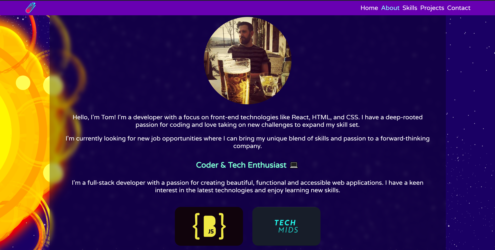
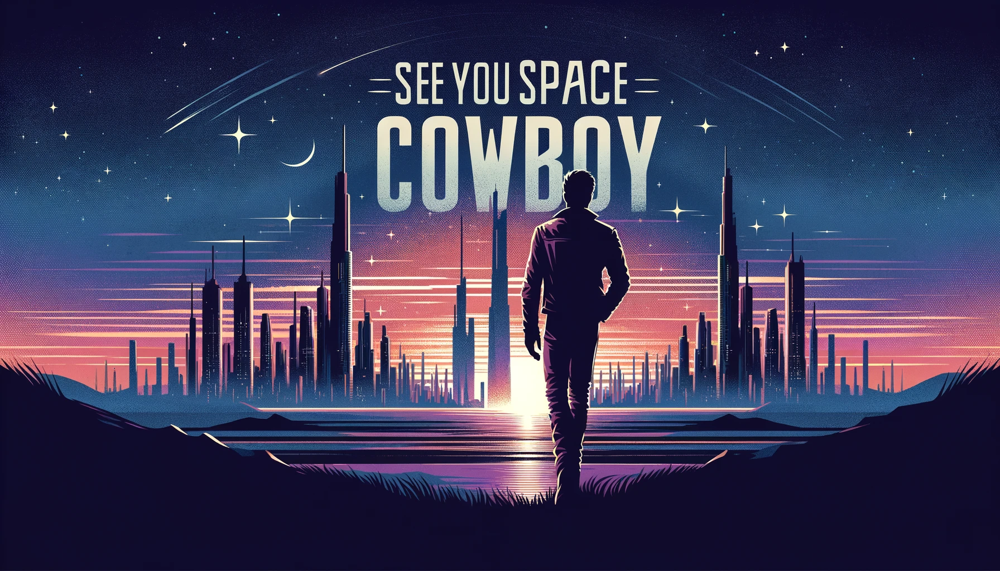

# Tom's Portfolio Site

Welcome to the repository for my personal portfolio site, showcased live at [tomdevspace.netlify.app](https://tomdevspace.netlify.app/). This site is a dynamic representation of my projects, skills, and professional journey as a software developer. It's built with React and designed to showcase my abilities and growth in web development.

Explore the live version to see my work in action, including a responsive design that ensures a great experience on any device, a detailed showcase of my projects, an about me section for professional insights, and a contact form for easy communication.

## Features
- **About Me:** A personal look into my background, interests, and technical skills.

- **Responsive Design:** Seamless experience across all devices (don't try it on an apple watch).

- **Project Showcase:** showcasing some of my projects as when they are completed.

- **Contact Form:** An easy way for visitors to connect with me for potential opportunities or collaborations.

- **Live Version:** Directly accessible at [tomdevspace.netlify.app](https://tomdevspace.netlify.app/) for a full, interactive experience.

## More projects to be added soon. 

- **Movie Review app:** Search movies checkout the stats and if you like, you can leave a review

- **Phonics memory game:** A game to help kids learn phonics, the idea is to match the end of the word. Dog and log, Cat and Hat simple and easy is what i'm aiming for.

## Technologies Used
- **React:** A JavaScript library for building user interfaces.
- **HTML5:** The latest version of the HTML markup language.
- **CSS3:** The latest version of the Cascading Style Sheets language.
- **Netlify:** A platform that offers continuous deployment and hosting services for static websites.
- **GitHub:** A provider of Internet hosting for software development and version control using Git.

## 
Thank you for visiting my portfolio site. If you have any questions or would like to connect, please feel free to reach out to me through the contact form on the site or via email at Tomulvlup@gmail.com or on [LinkedIn](https://www.linkedin.com/in/tomulvlup/). 

